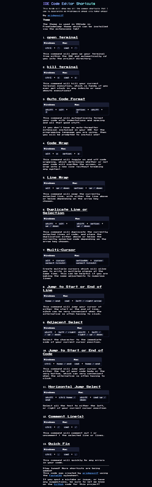

# IDE CODE EDITOR SHORTCUTS

A simple guide to essential IDE shortcuts that will accelerate your programming speed into hyper-space!

## 📖 About

This project showcases the most useful IDE shortcuts for Windows and Mac users to improve coding efficiency.

## 🌐 Live Demo

Check out the live version of the project: [IDE Shortcuts](https://ideshortcuts.vercel.app/)

## 📸 Screenshots

View the application in action:



## 🚀 Features

- **Clean, Retro Design**: Uses the "Press Start 2P" font for a unique, retro gaming aesthetic
- **Cross-Platform Support**: Shows equivalent shortcuts for both Windows and Mac
- **Comprehensive Coverage**: Includes shortcuts for terminal operations, code formatting, text navigation, selection, and more
- **Responsive Layout**: Works well on devices of various screen sizes

## 💻 Shortcuts Included

1. **Open Terminal** - Quick access to the integrated terminal
2. **Kill Terminal** - Stop running processes
3. **Auto Code Format** - Instantly format your code
4. **Code Wrap** - Toggle text wrapping
5. **Line Wrap** - Move lines up or down
6. **Duplicate Line or Selection** - Quickly duplicate code
7. **Multi-Cursor** - Edit in multiple places simultaneously
8. **Jump to Start or End of Line** - Navigate lines efficiently
9. **Adjacent Select** - Select text adjacent to cursor
10. **Jump to Start or End of Code** - Navigate to document extremes
11. **Horizontal Jump Select** - Select text to line boundaries
12. **Comment Line(s)** - Toggle comments on code
13. **Quick Fix** - Automatically fix code errors

## 🎨 Styling
The project uses a combination of custom CSS and the [FantaCSS](https://www.fantacss.smoljames.com) stylesheet for styling.

The VSCode FreeCodeCamp theme (available in the extensions marketplace) is recommended for the best visual experience.

## 🔧 Installation

1. Clone the repository:
   ```
   git clone https://github.com/aridepai17/ideshortcuts.git
   ```
2. Open `index.html` in your browser to view the shortcuts guide

## 🤝 Contributing
Contributions are welcome! If you spot a mistake or have suggestions for additional shortcuts:

1. Open an issue describing the problem or suggestion
2. Submit a pull request with your changes
3. Contact the developer through GitHub

## 📝 License
This project is open source and available for use and modification.

## 👨‍💻 Author
Created by [aridepai17](https://github.com/aridepai17)
